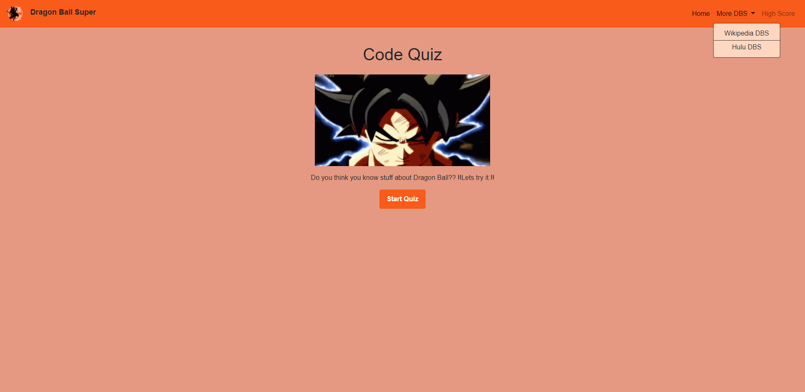
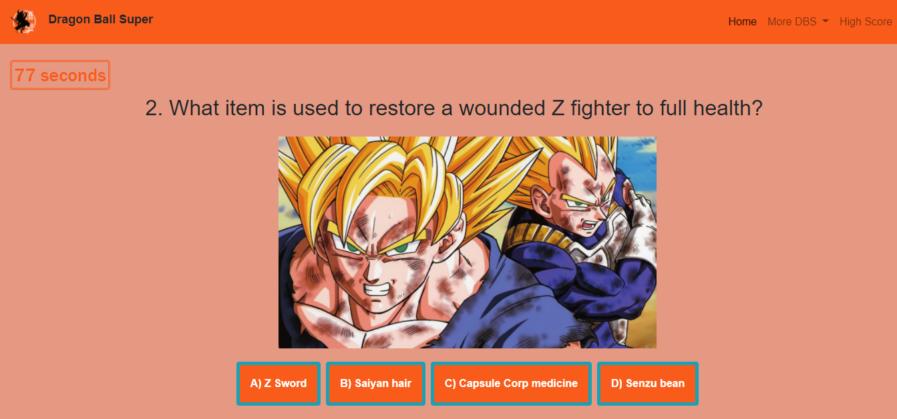
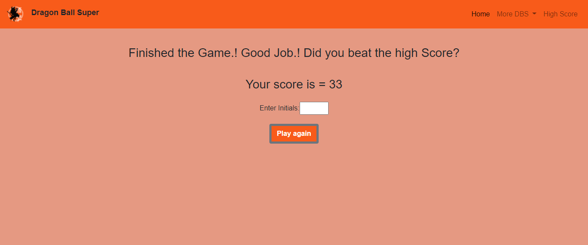
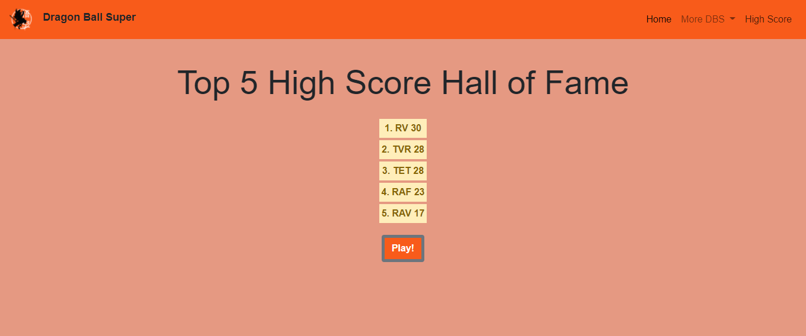

# Dragon Ball Quiz
---
## Task

Its a timed Dragon Ball quiz with multiple-choice questions. This app will run in the browser, and will feature dynamically updated HTML and CSS powered by JavaScript code that you write. It will have a clean, polished, and responsive user interface. 

You have 10 Questions, everytime you got a wrong one you get 10 seconds deducted from the final score.

## User Story

```
AS A coding boot camp student
I WANT to take a timed quiz on JavaScript fundamentals that stores high scores
SO THAT I can gauge my progress compared to my peers
```
### Built With
----
```
  * HTML
  * Custom CSS
  * Javascript
  * Bootstrap
```    
### Sections
----
```
  1- Home 
        * Restart Home Page
  2- Dropdown
        * Wikipedia Link (More info about Dragon Ball Z)
        * Hulu Link (Series of Dragon Ball Z)
  3- High Score 
        * You can see the top 5 High Scores
  4- Icon in Navbar
        * Home
```    

### Submission
---

Github Repo URL: 
[https://github.com/v1zconde/code_Quiz](https://github.com/v1zconde/code_Quiz)

Deployed URL: [https://v1zconde.github.io/code_Quiz/](https://v1zconde.github.io/code_Quiz/)

## Website
---
### Home Page

### Playing

### Enter Score

### High Score
